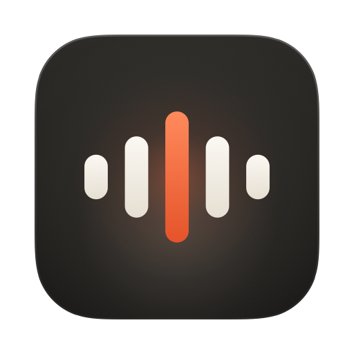
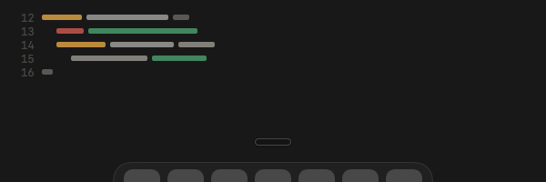

<p align="center">
  
</p>

<h1 align="center">Murmur</h1>

<p align="center"><b>Speak anywhere. It types for you.</b><br>
Push-to-talk dictation for macOS that runs entirely on your Mac.</p>

<p align="center">
  
</p>

Hold **fn**, talk, let go. Clean, punctuated text lands wherever your cursor is: Slack,
Mail, Cursor, Terminal, a browser, anything. Recognition runs on the Neural Engine with
**Parakeet Ultra**, so a 30-second thought is ready a few hundred milliseconds after you
release the key, and nothing you say leaves the machine unless you turn on cloud polish.

Murmur is a fork of [per-simmons/murmur-youtube](https://github.com/per-simmons/murmur-youtube),
rebuilt into a product meant to stand next to Wispr Flow.

## What it does

| | |
|---|---|
| **Dictation** | Hold the key to talk. Double-tap it, or press Space while holding it, for hands-free; tap again to finish. Esc cancels. Your hotkey never hijacks shortcuts like fn+← or ⌥+letter. |
| **Recognition** | Parakeet Ultra (NVIDIA's Parakeet TDT v3, post-trained by moondream) via FluidAudio on the Neural Engine. Parakeet v3, v2 and Apple Speech are one click away in Settings. While the model downloads, Apple Speech fills in, so it works from the first minute. |
| **History** | Every dictation with its audio. Search, copy, paste again, play it back, retry the transcription, and see exactly what the dictionary and polish changed. Audio is saved before transcription starts, so a failure never loses what you said. |
| **Paste last** | ⌃⌥V types your most recent dictation again, anywhere. |
| **Dictionary** | Teach it names and jargon. Words bias the recognizer (CTC vocabulary boosting), and "hear X → write Y" corrections are guaranteed. Also a plain text file you can edit by hand. |
| **Snippets** | Say "my calendly link", get the URL. |
| **Styles** | Formal, casual, very casual or excited, chosen per kind of app: personal messages, work chat, email, everything else. Gmail and Slack in a browser are recognised by window title. |
| **AI polish** (optional) | Removes false starts and applies self-corrections ("at 3, no wait, 4" → "at 4"). Runs on Apple Intelligence on-device, Claude with your Anthropic key, or any OpenAI-compatible endpoint (OpenAI, Groq, Ollama, LM Studio). It has a hard time limit and a guard that rejects rewrites that answer, refuse or invent; either way the plain transcript is used. Off by default. |
| **The pill** | A small dark HUD at the bottom of the screen that never takes focus: a live waveform while you talk, a travelling wave while it thinks, a check when it's done. Honors Reduce Motion. |

Quiet, synthesized sounds mark start, hands-free, stop, done, cancel and error, and can be
turned off.

## Install

**Download:** grab `Murmur.zip` from the [nightly release](https://github.com/futureLevi/murmur-youtube/releases/tag/nightly),
unzip, and move `Murmur.app` to Applications. It isn't notarized, so macOS blocks the first
launch: open **System Settings → Privacy & Security** and click **Open Anyway** (or run
`xattr -dr com.apple.quarantine /Applications/Murmur.app`). The nightly is ad-hoc signed, so
after each update macOS asks for Accessibility again.

**Build from source** (macOS 26, Xcode 26):

```bash
git clone https://github.com/futureLevi/murmur-youtube.git murmur
cd murmur
make install      # builds, signs, installs to /Applications, launches
```

`make install` signs with your Developer ID if you have one, which keeps the Accessibility
grant across rebuilds.

## First run

Onboarding walks through it in about a minute:

1. **Microphone**, to hear you while the key is held.
2. **Accessibility**, to notice the shortcut and type into other apps.
3. **Speech model**: Parakeet Ultra, a one-time ≈620 MB download that then runs offline.
4. **Shortcut**: fn, Right ⌥, Right ⌘ or Right ⌃. If you pick fn, set **System Settings →
   Keyboard → Press 🌐 key to: Do Nothing**, or macOS opens the emoji picker too. If Wispr
   Flow is still running on the same key, quit it or pick another key.
5. **Try it** in a practice field.

## Privacy

Audio and text stay on this Mac. History lives in
`~/Library/Application Support/Murmur/` (keep text forever by default; keep audio 7 days by
default, both adjustable). Models live in `~/Library/Application Support/FluidAudio/Models/`.
The only time anything is sent anywhere is when you choose a cloud polisher, and then only
the transcript text goes to the provider you picked. API keys are stored in your Keychain.

## How it's built

Swift 6 with strict concurrency, SwiftUI and AppKit, SwiftPM, macOS 26.

```
Sources/MurmurDictionary   correction rules (shared contract with windows/)
Sources/MurmurKit          pure logic, tested on Linux too: pipeline, styles, snippets,
                           history, stats, polish prompt, guard and HTTP clients
Sources/Murmur             the app: hotkeys, audio, engines, injection, HUD, UI
```

See [docs/ARCHITECTURE.md](docs/ARCHITECTURE.md) for the data flow and the rules the code
keeps (the HUD never takes focus; audio is saved before transcription; polish can only make
things better; the dictionary runs last).

```bash
make test         # unit tests (swift test also runs the logic layers on Linux)
make snapshots    # renders every screen to ./snapshots in light and dark
```

CI builds and tests every push on a macOS 26 runner, renders every screen to PNG, runs a
speech smoke test (synthesized speech through the real Parakeet model), and publishes logs
and screenshots to the `snapshots/<branch>` branch. Pushes to `main` refresh the nightly
release.

## Credits

- [per-simmons/murmur-youtube](https://github.com/per-simmons/murmur-youtube), the original
  app this fork grew from, and its dictionary contract.
- [NVIDIA Parakeet TDT](https://huggingface.co/nvidia/parakeet-tdt-0.6b-v3) and
  [moondream's Parakeet Ultra](https://huggingface.co/moondream/parakeet-ultra).
- [FluidAudio](https://github.com/FluidInference/FluidAudio) for CoreML models on the Neural
  Engine and CTC vocabulary boosting.

The `windows/` folder is the upstream Windows app and isn't maintained in this fork.

**License:** the upstream repository doesn't include a license, so its code is all rights
reserved by its author. Ask the original author before redistributing or selling builds of
this fork.
